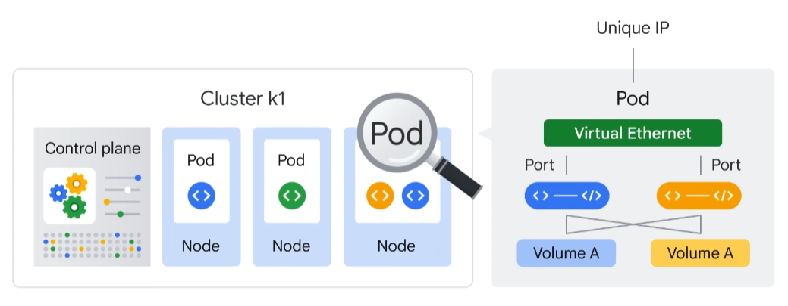

# Google Cloud

- [Google Cloud](#google-cloud)
  - [Kubernetes](#kubernetes)
    - [Pod](#pod)
    - [Deployment](#deployment)
    - [Service](#service)
    - [K8s overview](#k8s-overview)
  - [Cloud Run](#cloud-run)
  - [VPC](#vpc)
  - [Commands](#commands)
    - [Container images](#container-images)
    - [Buckets](#buckets)
  - [Storage Options](#storage-options)

## Kubernetes

### Pod 

- The smallest unit that can be created or deployed
- Represents a running process on the cluster as an app or a component of an app
- Usually there one container in one Pod
  - However you can package multiple dependencies into a single Pod and share networking and storage resources between them
- Pod provides a unique network IP and set of ports
- One way to run a container in a Pod is `kubectl run` (which starts a Deployment)

### Deployment
- Deployment represents a group of replicas of the same Pod 
  - it also keeps Pods running even when nodes they run on fail
- Deployment can represent a component of an application or even an entire app

### Service
- Service is an abstraction which defines a logical set of Pods and a policy of access to them
- Service has fixed IP (unlike ephemeral IP of Pods)

### K8s overview

## Cloud Run

- Managed compute platform that runs stateless containers via web requests or Pub/Sub events
- It's serverless, so it doesn't require any infrastructure management from you
- Built on Knative (an API and runtime environment built on Kubernetes)
- It scales very quickly, near instantaneously, and you pay only for what you used
- You can use both container-based and sourcecode-based workflow
  - Source code approach deploys the source code (instead of container image)\
  Cloud run then builds and packages the image (using Buildpacks)

## VPC

- Provides networking to Compute Engine VMs, Kubernetes Engine containers and App Engine flexible environment
  - It implies that without VPC man can't create VMs, containers or App Engine apps
  - Each GCP project has a default network
- VPC can be perceived like a physical network virtualized then within Google Cloud
- It's a global resource consisting of regional virtual subnets in data centers, all connected by global WAN
  - Each subnet is associated with a given region and a private CIDR block for internal IP address range and a gateway
- VPC networks are logically isolated from each other

## Commands

### Container images

- Build container image using Cloud Build (invoke it in directory with Dockerfile)
  - `gcloud builds submit --tag gcr.io/$GOOGLE_CLOUD_PROJECT/helloworld`
- List all the container images associated with current project
  - `gcloud container images list`
- Register gcloud as the credential helper for all Google-supported Docker registries
  - `gcloud auth configure-docker`
- Start app locally from Cloud Shell
  - `docker run -d -p 8080:8080 gcr.io/$GOOGLE_CLOUD_PROJECT/helloworld`
- Deploy containerized app to Cloud Run
  - `gcloud run deploy --image gcr.io/$GOOGLE_CLOUD_PROJECT/helloworld --allow-unauthenticated --region=$LOCATION`
  - The `allow-unauthenticated` flag in the command above makes your service publicly accessible.
- While Cloud Run does not charge when the service is not used, it still might charge for storing container images
- You can delete GCP project to avoid incurring charges (it will stop billing for all the resources used within that project), or just delete the image:
  - `gcloud container images delete gcr.io/$GOOGLE_CLOUD_PROJECT/helloworld`
- To delete the Cloud Run service run:
  - `gcloud run services delete helloworld --region=us-west1`

### Buckets

1. Create a new bucket
   - `gcloud storage buckets create -l $LOCATION gs://$DEVSHELL_PROJECT_ID`
2. Get a png from a public bucket
   - `gcloud storage cp gs://cloud-training/gcpfci/my-excellent-blog.png my-excellent-blog.png`
3. Copy png to the own bucket
   - `gcloud storage cp my-excellent-blog.png gs://$DEVSHELL_PROJECT_ID/my-excellent-blog.png`
4. Make it readable by everyone
   - `gsutil acl ch -u allUsers:R gs://$DEVSHELL_PROJECT_ID/my-excellent-blog.png`

## Storage Options

See separate article [here](./STORAGE%20COMPARISON/Storage%20Comparison.MD).